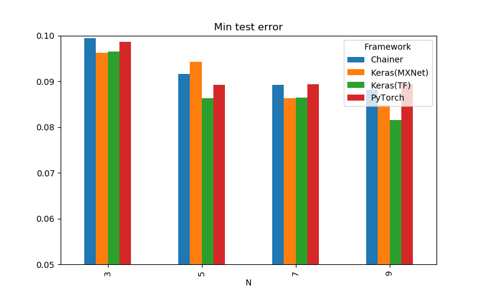
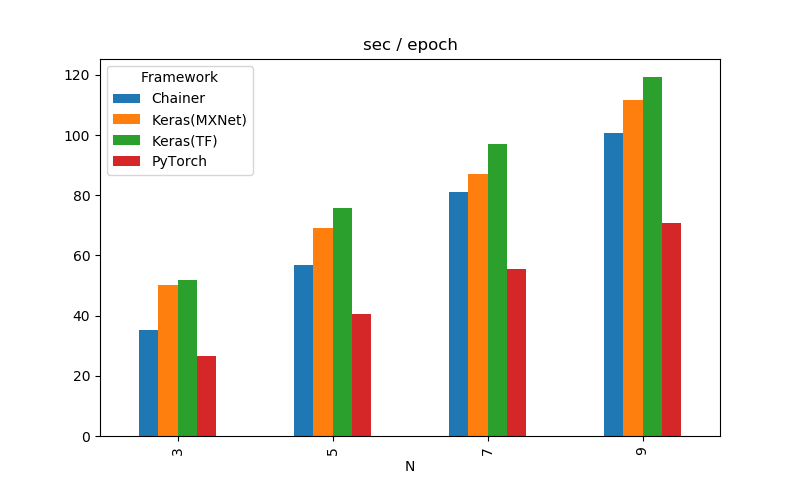

# ResNet-MultipleFramework
ResNet benchmark by Keras(TensorFlow), Keras(MXNet), Chainer, PyTorch using Google Colab

# Summary
| Framework    | N | # Layers | MinTestError | s / epoch |
|--------------|--:|---------:|-------------:|----------:|
| Keras(TF)    | 3 | 20       | 0.0965       | 51.817    |
| Keras(MXNet) | 3 | 20       | 0.0963       | 50.207    |
| Chainer      | 3 | 20       | 0.0995       | 35.360    |
| PyTorch      | 3 | 20       | 0.0986       | 26.602    |
| Keras(TF)    | 5 | 32       | 0.0863       | 75.746    |
| Keras(MXNet) | 5 | 32       | 0.0943       | 69.260    |
| Chainer      | 5 | 32       | 0.0916       | 56.854    |
| PyTorch      | 5 | 32       | 0.0893       | 40.670    |
| Keras(TF)    | 7 | 44       | 0.0864       | 96.946    |
| Keras(MXNet) | 7 | 44       | 0.0863       | 86.921    |
| Chainer      | 7 | 44       | 0.0892       | 80.935    |
| PyTorch      | 7 | 44       | 0.0894       | 55.465    |
| Keras(TF)    | 9 | 56       | 0.0816       | 119.361   |
| Keras(MXNet) | 9 | 56       | 0.0848       | 111.772   |
| Chainer      | 9 | 56       | 0.0882       | 100.730   |
| PyTorch      | 9 | 56       | 0.0895       | 70.834    |

* N denotes the number of shortcuts of each stage described in ResNet paper.
* For the number of layers, we used the formula 6N + 2 written in the paper. Since Conv2D stride 2 is used for subsampling instead of pooling, it is actually +2 this value.
* Time per epoch excluded the first epoch and took the average of the remaining 99 epochs.

# TPU in Colaboratory(updated at 9/30)
I also tried same expretiment using the free TPU of Google Colaboratory.

| Framework     | N | # Layers | MinTestError | s / epoch |
|---------------|--:|---------:|-------------:|----------:|
| TF-Keras(TPU) | 3 |       20 |        0.154 |    19.666 |
| TF-Keras(TPU) | 5 |       32 |        0.153 |    19.818 |
| TF-Keras(TPU) | 7 |       44 |        0.167 |    19.969 |
| TF-Keras(TPU) | 9 |       56 |        0.133 |    19.932 |

(TensorFlow：1.11.0-rc2、Keras：2.1.6)

**TPU is extremely fast!!!** TPU is at least x6 faster than GPU version of Keras, and x3.5 faster than PyTorch which was the fastest among GPU frameworks.

But sadly, however, LearningRateScheduler does not work on the TPU due to a bug in TensorFlow. Therefore, accuracy is a little bit worse than the GPU.

# See Details(Japanese)
* https://blog.shikoan.com/resnet-multiple-framework/
* https://blog.shikoan.com/colab-tpu-resnet-benchmarks/

# Settings
Parameters are based on the paper, but differences are

* Train on 100 epochs(The original iterates on 64k = 182 epochs).
* Not use verification datasets. Use 50k images for training.
* Initial learning rate is 0.01. Since it diverged when set to the original value 0.1. The learning rate scheduler remains to be used.
* Weight decay of regularization parameters was changed from 0.0001 to 0.0005 (as it tended to overfits overall).
* Run only once for each condition.

# Environment
| Library     | Version |
|-------------|:-------:|
| TensorFlow  | 1.10.1  |
| Keras       | 2.1.6   |
| mxnet-cu80  | 1.2.1   |
| Keras-mxnet | 2.2.2   |
| Chainer     | 4.4.0   |
| cupy-cuda80 | 4.4.0   |
| PyTorch     | 0.4.1   |
| Torchvision | 0.2.1   |

* Experiment on Google Colab(using GPU)

# Reference
K. He, X. Zhang, S. Ren, and J. Sun. Deep residual learning for image recognition. In *CVPR*, 2016
https://arxiv.org/abs/1512.03385
